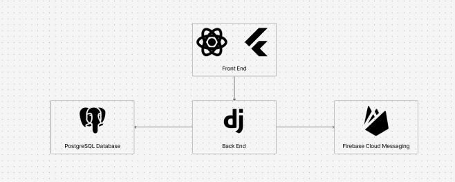

# Spécifications fonctionnelles - TaskMaster

## 1. Fonctionnalités principales

### a. Gestion des tâches
Les utilisateurs peuvent créer des tâches récurrentes (quotidiennes, hebdomadaires) via une interface simple. Ils peuvent également :
- **Créer une nouvelle tâche** avec un titre, une description, une date limite, et un type de récurrence.
- **Éditer une tâche** existante pour changer son contenu ou ses dates.
- **Supprimer une tâche** définitivement.

### b. Notifications et rappels
L'application enverra des notifications sous plusieurs formes :
- **Notifications push** sur mobile (iOS et Android) pour rappeler aux utilisateurs leurs tâches.
- **Notifications web** via Firebase Cloud Messaging.
- **Notifications par email** si l'utilisateur préfère recevoir ses rappels par ce moyen.

### c. Suivi des performances
TaskMaster propose des statistiques pour suivre la progression des utilisateurs :
- **Taux de complétion** : Pourcentage de tâches complétées sur une période donnée.
- **Jours consécutifs** : Suivi des jours où l'utilisateur a accompli toutes ses tâches.
- **Graphiques** de suivi pour une visualisation simple des performances.

### d. Challenges automatiques
L'application génère des **challenges automatiques** basés sur la performance de l'utilisateur. Par exemple :
- Réaliser toutes ses tâches pendant 7 jours consécutifs.
- Compléter un certain nombre de tâches en une semaine.

## 2. Scénarios d'utilisation
### a. Création d'une tâche
1. L'utilisateur se connecte à l'application.
2. Il accède à la section "Tâches".
3. Il clique sur le bouton "Ajouter une nouvelle tâche".
4. Il remplit les champs requis (titre, description, date, récurrence).
5. Il sauvegarde la tâche.
6. La tâche est ajoutée à la liste et sera rappelée à l'utilisateur via notification.

### b. Réception d'une notification push
1. L'utilisateur reçoit une notification sur son appareil mobile ou via le web.
2. Il clique sur la notification et est redirigé vers l'application.
3. Il voit la tâche concernée et peut marquer la tâche comme "complétée" ou "reportée".

### c. Visualisation des statistiques
1. L'utilisateur accède à la section "Statistiques" via le menu principal.
2. Il visualise les tâches accomplies et les jours consécutifs dans un graphique.
3. Il voit également son taux de complétion pour la semaine ou le mois en cours.

---

## 3. Critères d'acceptation
- Les tâches sont créées, modifiées et supprimées sans erreur.
- Les notifications sont envoyées à l'utilisateur à l'heure définie.
- Les statistiques sont correctement mises à jour à chaque nouvelle tâche complétée.
- Les challenges sont générés automatiquement après analyse des performances.

---

## 3. API RESTful

### a. Gestion des utilisateurs
**Endpoint** : `/api/users/`

| Méthode | Description                    | Paramètres                 |
|---------|--------------------------------|----------------------------|
| `POST`  | Créer un nouvel utilisateur     | `username`, `email`, `password` |
| `GET`   | Récupérer les informations d'un utilisateur | `user_id`                  |

### b. Gestion des tâches
**Endpoint** : `/api/tasks/`

| Méthode | Description                    | Paramètres                 |
|---------|--------------------------------|----------------------------|
| `POST`  | Créer une nouvelle tâche        | `title`, `description`, `due_date`, `recurrence` |
| `GET`   | Récupérer la liste des tâches   | `user_id`                  |
| `PUT`   | Modifier une tâche              | `task_id`, `new_title`, `new_description` |
| `DELETE`| Supprimer une tâche             | `task_id`                  |

### c. Notifications
**Endpoint** : `/api/notifications/`

| Méthode | Description                    | Paramètres                 |
|---------|--------------------------------|----------------------------|
| `POST`  | Envoyer une notification        | `user_id`, `message`       |
| `GET`   | Récupérer les notifications     | `user_id`                  |
